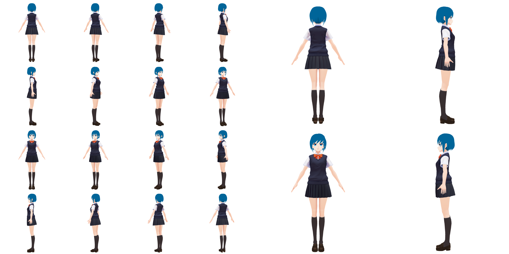

# NOVA-3D: Non-overlapped Views for 3D Anime Character Reconstruction
Official PyTorch implementation of **NOVA-3D**

<center style="font-size:14px;color:#C0C0C0;text-decoration:underline">Left: NOVA-3D achieves full-body anime character reconstruction from non-overlapped views. Right: The excellent results of NOVA-3D on head reconstruction of anime characters, with exquisite texture details, clear contours as well as 3D consistency.</center> 

[Project Page](https://nova-3d-anime-character-synthesis.github.io/NOVA-3D/) \| [Dataset](https://www.alipan.com/s/FqiHyraNCZd)

## Abstract

In the animation industry, 3D modelers typically rely on front and back non-overlapped concept designs to guide the 3D modeling of anime characters. However, there is currently a lack of automated approaches for generating 3D character models directly from these 2D designs. In light of this, we propose to investigate a novel task of reconstructing 3D anime characters from non-overlapped views. Currently, there are two main challenges to this task. The first challenge is that existing multi-view reconstruction approaches, due to the absence of overlapping regions, are unable to directly apply to 3D reconstruction tasks. The second challenge is the lack of available full-body anime character data and standard benchmarks to support the task. To this end, we present NOVA-3D, a new framework for directly reconstructing full-body 3D anime characters from non-overlapped front and back views. On one hand, NOVA-3D implements an encoder for feature extraction at varying granularities, effectively enhancing the quality and detail expression of synthesized images. On the other hand, this framework allows viewpoint direction-adaptive feature fusion, enabling it to learn 3D-consistent features from non-overlapped views effectively. To realize the NOVA-3D framework, we collected the NOVA-Human dataset, which comprises multi-view images and accurate camera parameters for 3D anime characters. Extensive experiments demonstrate that the proposed method outperforms baseline approaches, successfully reconstructing anime characters with refined details and 3D consistency. In addition, in order to verify the effectiveness of our method, we applied it to the task of animation head reconstruction and achieved higher reconstruction quality than the baseline method.

## Result
<div align="center">
   
</div>
<p align="center">These two are 360-degree displays of the head of 3D anime character model.</p>
<div align="center">
   
</div>
<p align="center">These two are 360-degree displays of the full-body of 3D anime character model.</p>

## Environment Setup

```
cd NOVA-3D
conda env create -f environment.yaml
conda activate env_nova3d
export PROJECT_DN=$(pwd)
export MACHINE_NAME=gpuA100
```

## Training
   Training with Vroid 3D dataset
```
nohup sh ./_train/eg3dc/runs/multi_panic3d/multi_view_panic3d_mask_encoder_attention_train.sh >> mv_panic_mask_encoderPat_attention.out &
```
   Training with NOVA-Human dataset
```
nohup sh ./_train/eg3dc/runs/human_multi_panic3d/human_multi_view_panic3d_mask_encoder_attention_train.sh >> human_mv_panic3d_mask_pat_attention_735709060.out &
```
## Generating results
   Inferencing for Vroid 3D dataset
```
nohup python -m _scripts.eval.human_generate --inferquery multi_panic3d-00000-002040 --dataset multi --generator_module training.triplane.TriPlaneGenerator_v1 >> generate_nova_head.out & 
```
   Inferencing for NOVA-Human dataset
```
nohup python -m _scripts.eval.human_generate --generator_module training.triplane.TriPlaneGenerator_v1 --dataset human --inferquery human_mv_panic3d_mask_encoder_attention-00001-000920 >> generate_nova_body.out &
```

## Metrics
Run this line to reproduce the best-result metrics from our paper.  There might be minor hardware variations and randomness in rendering; below are results from two different machines.  
Metrics for Vroid 3D dataset: 
```
nohup python -m _scripts.eval.human_measure --inferquery human_mv_panic3d_mask_encoder_attention-00001-000920 >> measure_nova_body.out &
```
Metrics for NOVA-Human dataset: 
```
nohup python -m _scripts.eval.human_measure --inferquery multi_panic3d-00000-002040 --dataset multi >> measure_nova_head.out &
```
## Datasets format
Download [NOVA-Human](https://www.alipan.com/s/FqiHyraNCZd) dataset
After these, the folder structure should look like this(front images and back images in ortho folder and front features and back features in ortho_katepca_chonk are used as input, the rest are used as supervisory signals).
```
|-- human_rutileE/  
   |-- ortho/  
   |-- ortho_katepca_chonk/
   |-- ortho_mask/
   |-- ortho_xyza/
   |-- rgb/
   |-- rgb_mask/
   |-- xyza/
   |-- human_rutileE_meta.json
```

## Dataset

We curated a large dataset comprising 10.2k 3D anime character models from the open-source platform VroidHub. We named it the **NOVA-Human** dataset.

<div align=center><p></p>
<center style="font-size:14px;color:#C0C0C0;text-decoration:underline">Here are some anime characters from various works in the ACG (Anime, Comic and Game) field showcased in the NOVA-Human dataset. It includes well-known characters in the ACG community such as Hatsune Miku, Uzumaki Naruto, Kiana, Ram, Megumin, and Kamado Nezuko.</center> </div>

<div align=center><p></p>
<center style="font-size:14px;color:#C0C0C0;text-decoration:underline">Here we present the training data sampled from a 3D anime character model in NOVA-Human. On the left are 16 randomly sampled views, while on the right are four fixed orthogonal sampled views.</center> </div>

<div align=center><p></p>
<center style="font-size:14px;color:#C0C0C0;text-decoration:underline">Here are the anime characters with a futuristic or near-futuristic Cyberpunk style showcased in the NOVA-Human dataset.</center> </div>

<div align=center><p></p>
<center style="font-size:14px;color:#C0C0C0;text-decoration:underline">Here are the anime characters with a Gothic style showcased in the NOVA-Human dataset.</center> </div>

<div align=center><p></p>
<center style="font-size:14px;color:#C0C0C0;text-decoration:underline">Here are the anime characters with a Dark Horror style showcased in the NOVA-Human dataset.</center> </div>

<div align=center><p></p>
<center style="font-size:14px;color:#C0C0C0;text-decoration:underline">Here are the anime characters with different body types and races showcased in the NOVA-Human dataset, including Beast ear Niang, Elf, Demons, Robots, and more.</center> </div>

<div align=center><p></p>
<center style="font-size:14px;color:#C0C0C0;text-decoration:underline">Here are anime characters with niche styles showcased in the NOVA-Human dataset, including various unique and unconventional characters.</center> </div>

<div align=center><p></p>
<center style="font-size:14px;color:#C0C0C0;text-decoration:underline">Here we showcase additional sampled views from the NOVA-Human dataset. Our dataset encompasses a diverse range of 3D anime characters.</center> </div>

